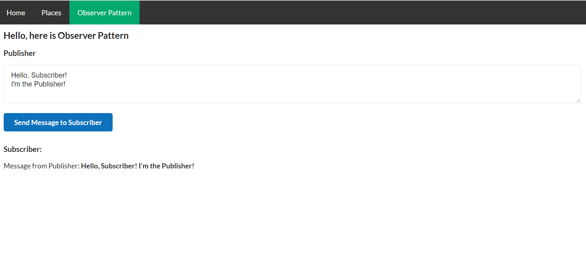

# Test project for practice and doing some task

## How to start

1. You need to install json-serve: `npm install -g json-server `
2. `yarn install`
3. `yarn start`

## TASK 2
Реализовать класс Observer, который позволит компоненту Publisher передавать значение компоненту Subscriber

